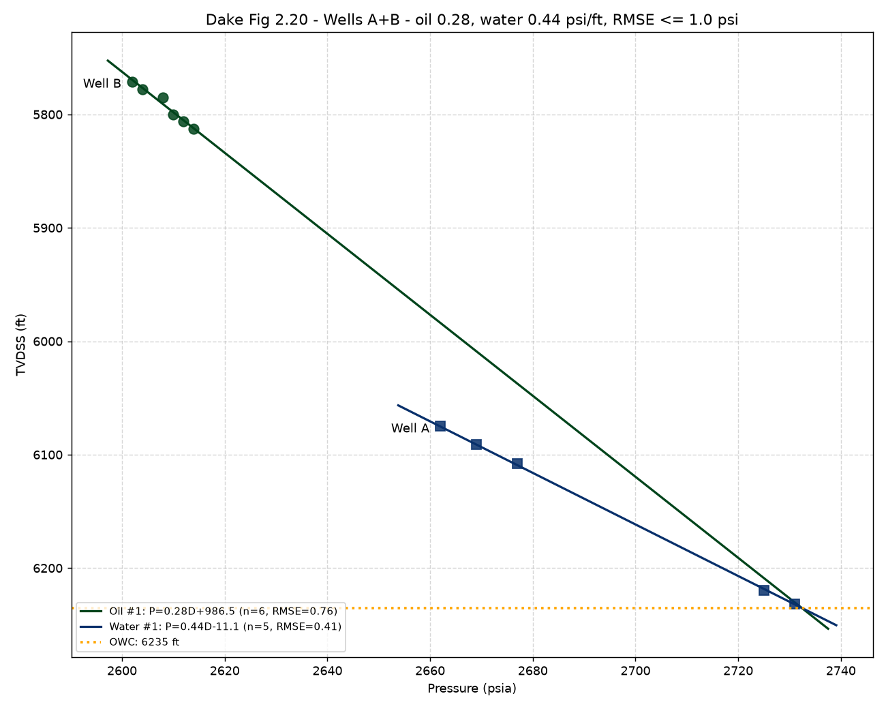
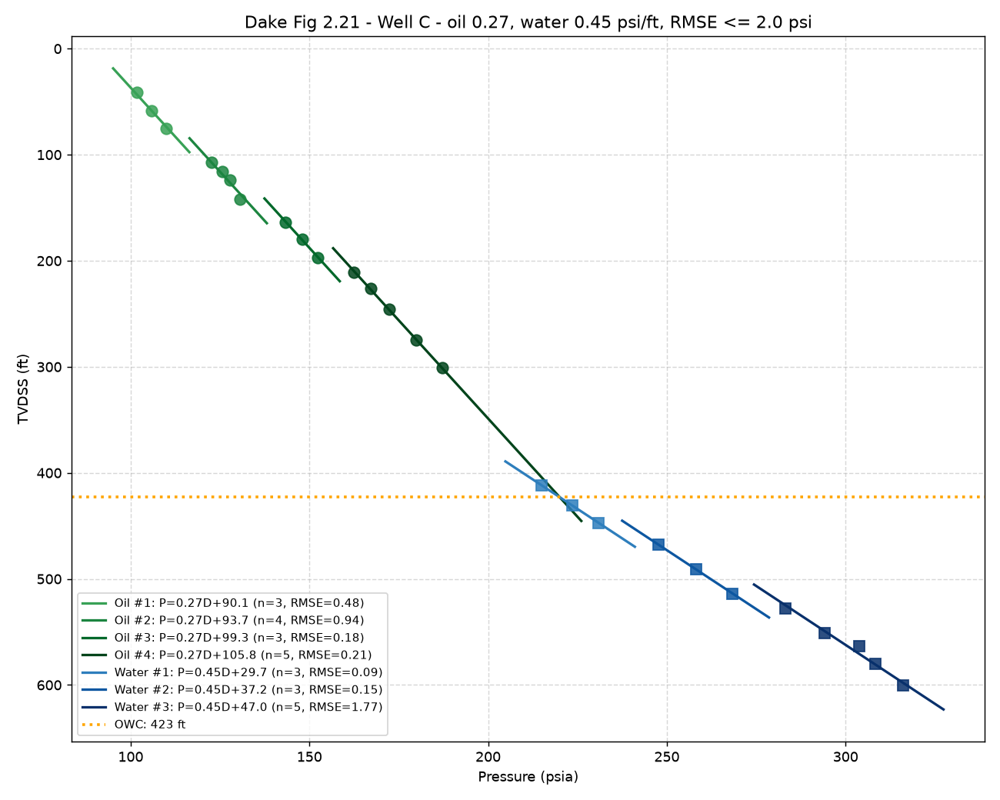

# Validation against Dake, The Practice of Reservoir Engineering, section 2.7

| Check | Dake | rftinterp | Tolerance | Result | Source |
|---|---|---|---|---|---|
| AB_owc | 6235.0 | 6235.092 | +/-2.0 | PASS | Fig. 2.20 / text p. 60: OWC at 6235 ft.ss |
| AB_oil_grad | 0.28 | 0.274 | +/-0.02 | PASS | p. 60: PVT oil gradient 0.28 psi/ft |
| AB_wat_grad | 0.44 | 0.436 | +/-0.01 | PASS | p. 60: water gradient 0.44 psi/ft |
| C_free_oil | 0.355 | 0.347 | +/-0.02 | PASS | Fig. 2.21a: forced oil gradient 0.355 psi/ft |
| C_free_wat | 0.577 | 0.564 | +/-0.03 | PASS | Fig. 2.21a: forced water gradient 0.577 psi/ft |
| C_layer_step | 5.0 | 6.614 | +/-3.0 | PASS | p. 61: ~5 psi perturbations between layers |
| C_owc_shift | 90 (deeper) | 55.1 | > 30 ft deeper | PASS | p. 62: incorrect method gives optimistic (deeper) OWC |

**7/7 checks passed.**

Fig. 2.21 data are digitised (+/-2-3 psi, +/-3 ft); tolerances reflect this.

## Interpretation output

```
=== Dake Fig 2.20 - Wells A+B: wells ['A', 'B'], 11 points ===
  gradients: oil 0.28, water 0.44 psi/ft; RMSE limit 1.0 psi
  Oil line 1: 5771-5813 ft, n=6, intercept=986.53, RMSE=0.76
  Water line 1: 6075-6232 ft, n=5, intercept=-11.09, RMSE=0.41
  ODT = 5813.0 ft, WUT = 6075.0 ft
  OWC = 6235.1 ft (+/- 13 ft)
  Consistency: INCONSISTENT: OWC well outside ODT-WUT; oil and water points are probably in different compartments (e.g. sealing fault)

=== Dake Fig 2.21 - Well C: wells ['C'], 26 points ===
  gradients: oil 0.27, water 0.45 psi/ft; RMSE limit 2.0 psi
  Oil line 1: 41-75 ft, n=3, intercept=90.07, RMSE=0.48
  Oil line 2: 107-142 ft, n=4, intercept=93.66, RMSE=0.94, step +3.6 psi
  Oil line 3: 164-197 ft, n=3, intercept=99.29, RMSE=0.18, step +5.6 psi
  Oil line 4: 211-301 ft, n=5, intercept=105.84, RMSE=0.21, step +6.5 psi
  Water line 1: 412-447 ft, n=3, intercept=29.70, RMSE=0.09
  Water line 2: 468-514 ft, n=3, intercept=37.21, RMSE=0.15, step +7.5 psi
  Water line 3: 528-601 ft, n=5, intercept=47.01, RMSE=1.77, step +9.8 psi
  ODT = 300.8 ft, WUT = 411.6 ft
  OWC = 422.9 ft (+/- 22 ft)
  Consistency: consistent within uncertainty
  Free-fit (incorrect) OWC = 478.0 ft (oil 0.347, water 0.564 psi/ft)
```



